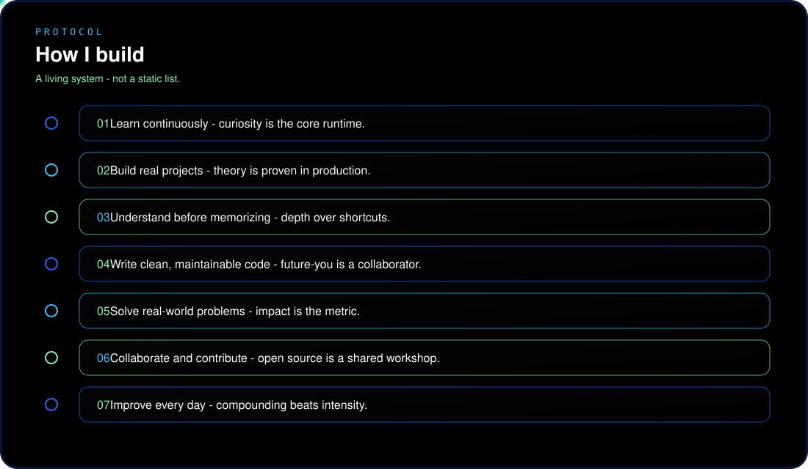
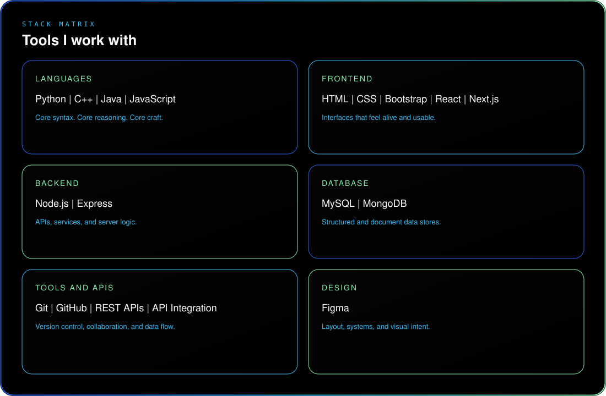

  

 

  

 

  
  
  
  

  

  

  

  

### Short introduction

I am **Aditya Kr. Sharma** — **Aspiring AI/ML Engineer** based in **Bokaro Steel City, Jharkhand**.
I learn by building, experiment through projects, and focus on creating clean, practical systems that solve real problems.
**Current focus: Python, Web Development, Machine Learning, and Generative AI.**

  

  

  

  

  

  

  

  

 

**Languages**

**Frontend**

**Backend**

**Database**

**Tools & APIs**

**Design**

  

### Selected work

Placeholder cards only — replace with real projects when you are ready to publish them.

  

  

### GitHub activity

  
  

 

  

  

### Contact

 

  

