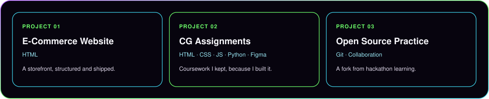

<!--
  Replace placeholders before publishing:
  [YOUR NAME] [YOUR TITLE] [YOUR TAGLINE] [YOUR LOCATION]
  [YOUR GITHUB] [YOUR_GITHUB_USERNAME] [YOUR_EMAIL]
  [YOUR_LINKEDIN_URL] [YOUR_PORTFOLIO_URL] [YOUR PROFILE IMAGE]

  After you set YOUR_GITHUB_USERNAME, uncomment the GitHub stats block.
-->

<div align="center">
  
</div>

<div align="center">
  
</div>

<br/>

<div align="center">
  <a href="https://github.com/YOUR_GITHUB_USERNAME">
    
  </a>
  <a href="YOUR_LINKEDIN_URL">
    
  </a>
  <a href="mailto:YOUR_EMAIL">
    
  </a>
  <a href="YOUR_PORTFOLIO_URL">
    
  </a>
</div>

<br/>

<div align="center">
  
</div>

<br/>

<div align="center">
  
</div>

<br/>

<div align="center">
  
</div>

---

### Short introduction

I am **[YOUR NAME]** — **[YOUR TITLE]** based in **[YOUR LOCATION]**.

I learn by building. I care about clean systems, real problems, and work that compounds over time.

Current focus: **[YOUR CURRENT FOCUS]**

<div align="center">

```bash
$ whoami
> [YOUR NAME]

$ focus
> [YOUR CURRENT FOCUS]
> Artificial Intelligence
> Machine Learning
> Web Development

$ status
> Learning | Building | Improving
```

</div>

<div align="center">
  
</div>

### My ideology

<div align="center">

| | Principle | Practice |
| :---: | :--- | :--- |
| **01** | Learn continuously | Curiosity is the core runtime |
| **02** | Build real projects | Theory is proven in production |
| **03** | Understand before memorizing | Depth over shortcuts |
| **04** | Write clean, maintainable code | Future-you is a collaborator |
| **05** | Solve real-world problems | Impact is the metric |
| **06** | Collaborate and contribute | Open source is a shared workshop |
| **07** | Improve every day | Compounding beats intensity |

</div>

<br/>

<div align="center">
  
  
  
  
  
  
  
</div>

<div align="center">
  
</div>

### Comet graph

Consistency → Activity → Growth → Progress

Live contribution graphs need a real GitHub username. After you replace `YOUR_GITHUB_USERNAME`, uncomment the activity-graph image in this file.

<div align="center">
  
  -000000?style=for-the-badge" alt=""/>
  
  -000000?style=for-the-badge" alt=""/>
  
  -000000?style=for-the-badge" alt=""/>
  
</div>

<br/>

<!--
<div align="center">
  
</div>
-->

<div align="center">
  
</div>

### Tech stack

<div align="center">

**Languages**


**Frontend**


**Backend**


**Database**


**Tools and APIs**


**Design**


</div>

<div align="center">
  
</div>

### Selected work

Placeholder cards only — replace with real projects when you are ready to publish them.

<div align="center">
  
</div>

<div align="center">
  
</div>

### GitHub activity

Stats are commented out so this README does not show API errors for the placeholder username.

When your username is set, uncomment this block:

<!--
<div align="center">
  
  
</div>
<br/>
<div align="center">
  
</div>
-->

<div align="center">
  
</div>

<div align="center">

### Contact

<a href="https://github.com/YOUR_GITHUB_USERNAME">
  
</a>
<a href="YOUR_LINKEDIN_URL">
  
</a>
<a href="mailto:YOUR_EMAIL">
  
</a>
<a href="YOUR_PORTFOLIO_URL">
  
</a>

</div>

<br/>

<div align="center">
  
</div>
