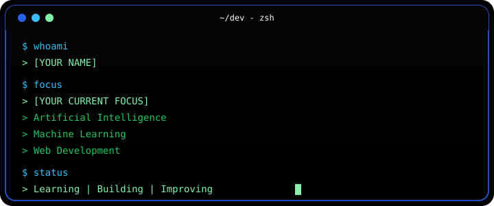
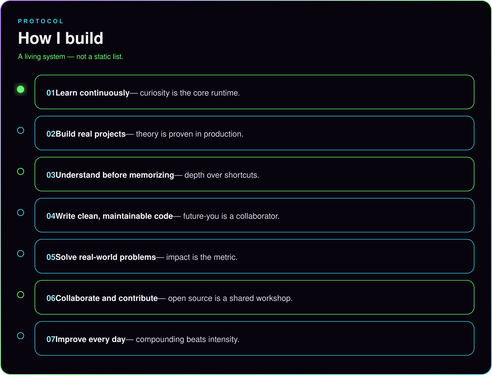
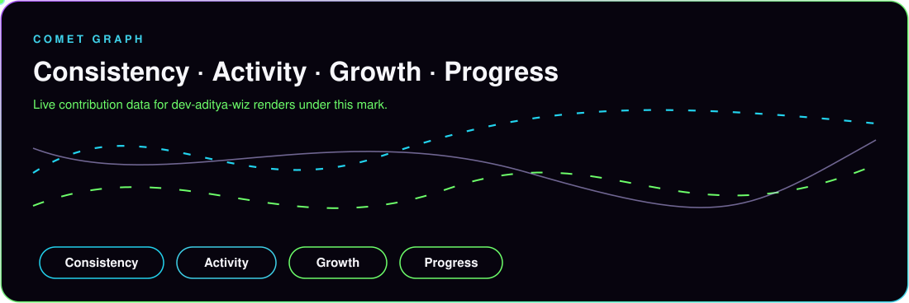
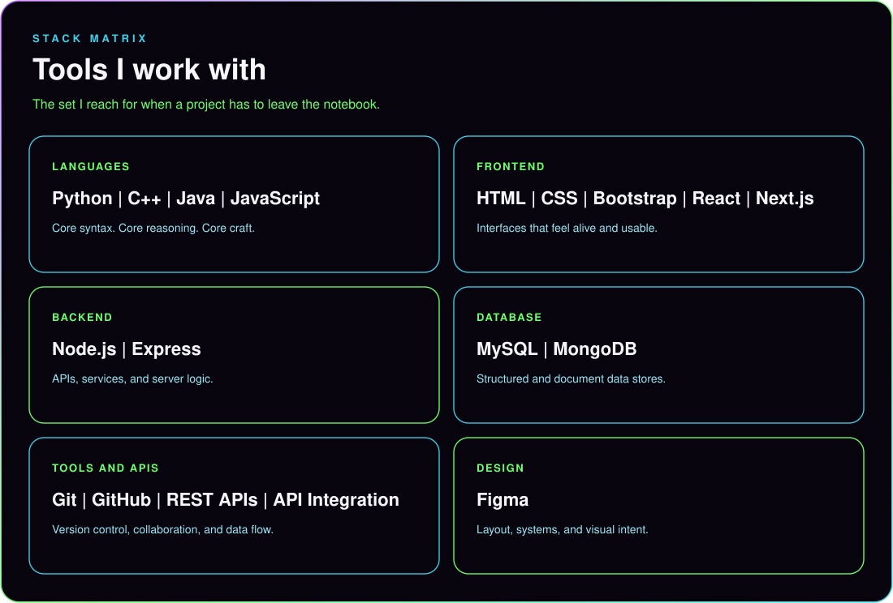

<!--
  GitHub profile README for https://github.com/dev-aditya-wiz
  Name, location, and focus come from the public GitHub profile.
  LinkedIn, email, and a portfolio URL are not on the profile yet.
  Drop them into the contact row when you want them public.
-->

  

 

  

 

  
  
  

 

  

 

  

 

### About

I'm **Aditya Kumar Sharma**, a computer science student in India.

I learn by building. I care about work that stays readable after the deadline, and about problems that exist outside the tutorial. The lane I'm in right now is artificial intelligence, machine learning, and full-stack web — Python on one side, interfaces and APIs on the other.

  

 

  

 

  

 

  

 

  

 

  

 

  

 

  

 

  

 

### Selected work

Three public repos. Each one is something I actually built or studied in the open.

  

 

  
  
  

 

  

 

### GitHub activity

  
  

 

  

 

  

 

### Contact

 

  

